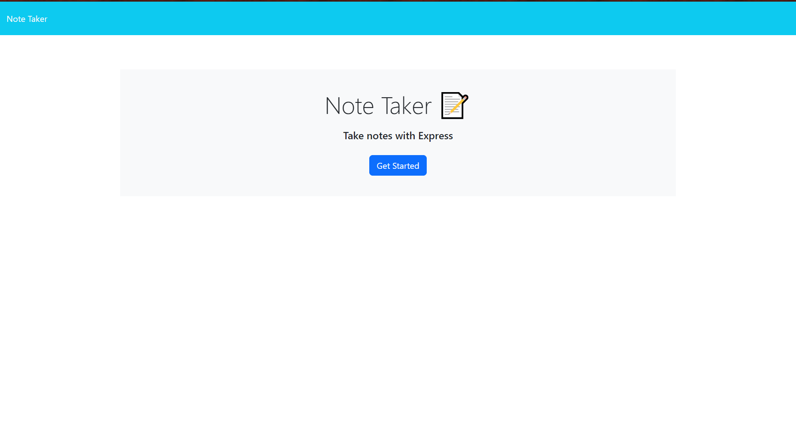
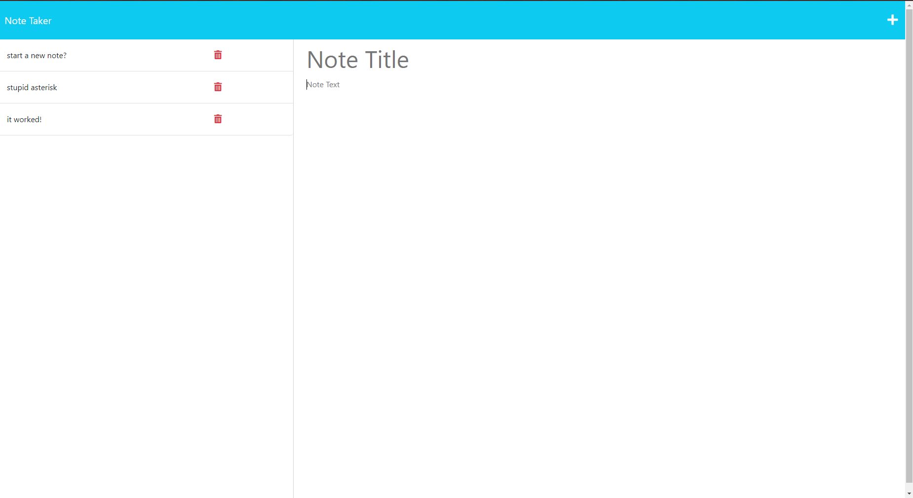

# noticed
  

- [Installation](#installation)

- [Usage](#usage)

- [Contribution](#contributing)

- [License](#license)

## License

an almost full stack note taking application

## Installation

simply open the website on heroku!

[the website](https://notice-taker.herokuapp.com/).

## Usage

click on some buttons, create or delete some notes!

## Contributing

please do not contribute

## Questions

Contact me!

Github: https://github.com/azrazel95

Email: beni.sprenger@hotmail.com

